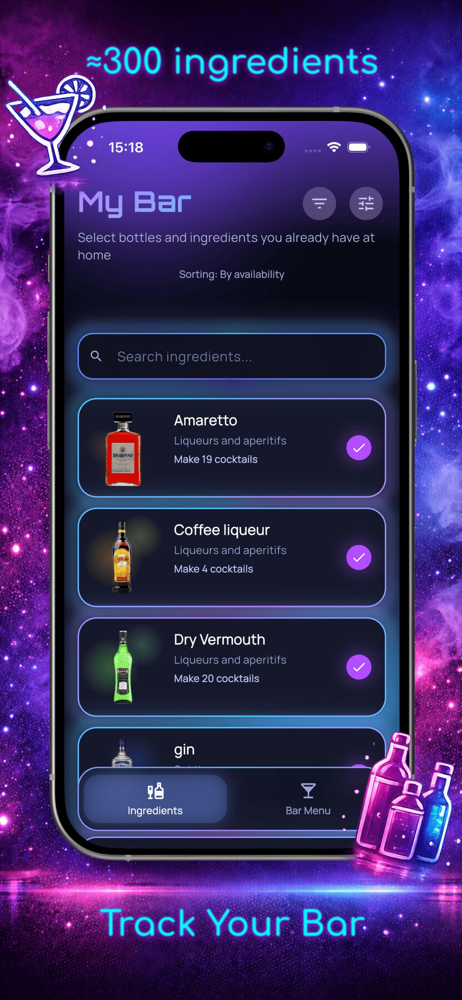
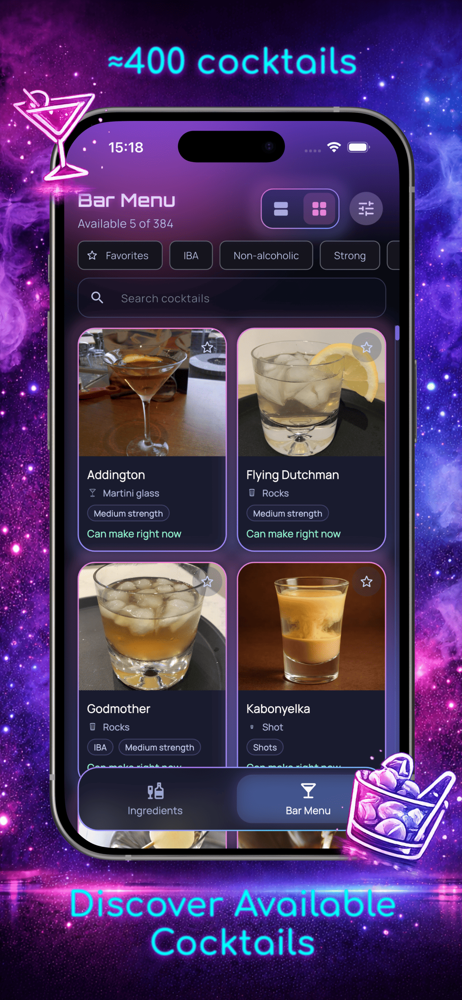
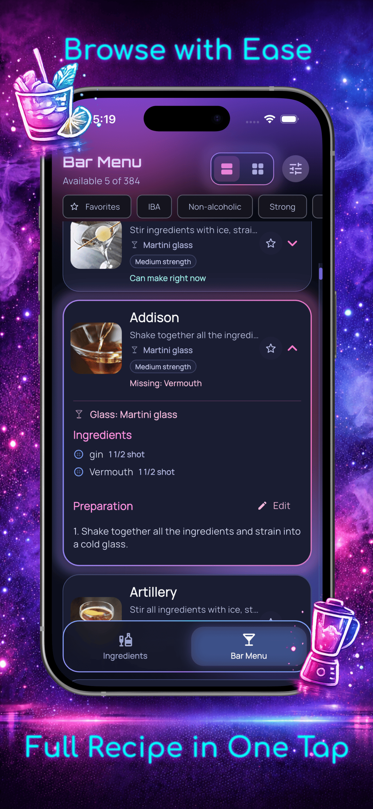
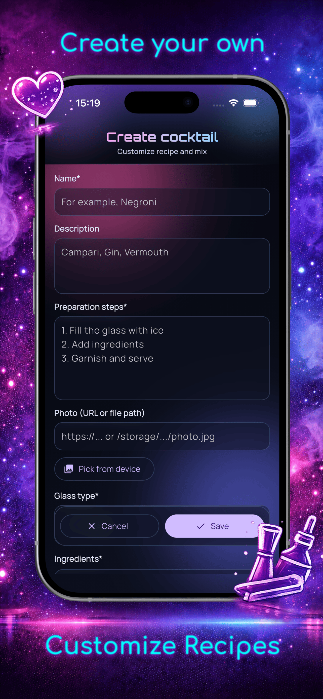
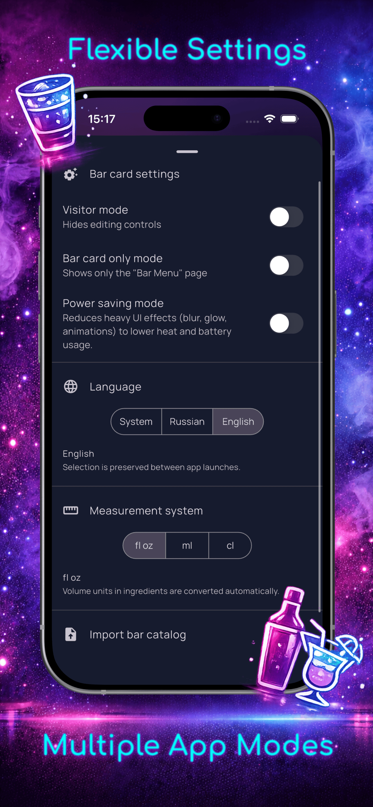

# My Bar

<p align="right">
  <a href="./README.md"><strong>English</strong></a> | <a href="./README.ru.md">Русский</a>
</p>

<p align="center">
  
</p>

A Flutter mobile app for managing your home bar:

- mark ingredients you currently have,
- see which cocktails are available right now,
- create and edit ingredients and cocktails,
- import and export your bar catalog as JSON.

## Key Features

- `Raw Bar`: ingredients list, search, sorting, availability toggles.
- `Bar Menu`: available cocktails in list or grid view, tags, favorites.
- Neon-inspired UI: gradients, glow effects, custom tooltips, custom scrollbar.
- Ingredient editor: create/update ingredients, including image URL or local file path.
- Cocktail editor: dedicated create/edit page with full recipe configuration.
- Recipe logic: optional ingredients, garnish ingredients, substitutions, amounts, and units.
- Measurement systems: `ml`, `cl`, `fl oz`.
- UI modes: `Visitor Mode` and `Bar Menu Mode`.
- Power-saving mode support.
- Persistence: selected ingredients, catalog, and UI settings are saved between launches.
- JSON import/export with validation (ingredients + cocktails).
- Empty export protection: shows `Bar catalog not changed` when there is nothing to export.

## Technology Stack

- Flutter + Dart
- BLoC/Cubit (`flutter_bloc`)
- Local storage: `shared_preferences`
- File import: `file_picker`
- Export/sharing: `path_provider`, `share_plus`
- UI effects: `animated_border_widgets`, `loading_animation_widget`, `google_fonts`

## Architecture

The project follows layered architecture:

- `domain`: models (`Ingredient`, `Cocktail`, `BarCatalog`) and constants (tags, glass types, units).
- `data`: storage abstractions + implementations (`SharedPreferences`), JSON codec.
- `cubit`: `BarCubit` + `BarState` with core app logic.
- `presentation`: `BarHomeShell`, pages, and UI widgets.

App state is centralized in `BarCubit` and persisted on every change.

## Project Structure

- `lib/app` - app bootstrap and top-level app wiring.
- `lib/core` - theme, base widgets, localization, search helpers.
- `lib/features/bar` - main bar feature (data/domain/cubit/presentation).
- `assets/data/bar_template.json` - default catalog template.
- `assets/icon.png` - source app icon.
- `docs/privacy-policy.md` - privacy policy template for store distribution.
- `test/` - unit and widget tests.

## Screenshots

<table>
  <tr>
    <td align="center" valign="top">
      
      <br />
      <sub><b>Raw Bar</b></sub>
      <br />
      <sub>Ingredient search, sorting, and availability</sub>
    </td>
    <td align="center" valign="top">
      
      <br />
      <sub><b>Bar Menu (Grid)</b></sub>
      <br />
      <sub>Grid layout for quick browsing</sub>
    </td>
  </tr>
  <tr>
    <td align="center" valign="top">
      
      <br />
      <sub><b>Bar Menu (List)</b></sub>
      <br />
      <sub>Expanded cocktail card with recipe details</sub>
    </td>
    <td align="center" valign="top">
      
      <br />
      <sub><b>Cocktail Editor</b></sub>
      <br />
      <sub>Create and tune recipes</sub>
    </td>
  </tr>
  <tr>
    <td align="center" valign="top">
      
      <br />
      <sub><b>Settings</b></sub>
      <br />
      <sub>Multiple App Modes</sub>
    </td>
  </tr>
</table>

## Bar Catalog JSON Format

The import/export file structure:

```json
{
  "ingredients": [
    {
      "id": "vodka",
      "name": "Vodka",
      "category": "Strong spirits",
      "image": "",
      "isDecoration": false,
      "isOptional": false
    }
  ],
  "cocktails": [
    {
      "id": "black-russian",
      "name": "Black Russian",
      "image": "",
      "ingredients": ["vodka", "coffee_liqueur"],
      "description": "Strong coffee cocktail",
      "preparationSteps": [
        "Fill a rocks glass with ice",
        "Add ingredients and stir gently"
      ],
      "glassType": "Rocks",
      "tags": ["Strong", "IBA"],
      "ingredientSubstitutions": {
        "coffee_liqueur": ["kahlua"]
      },
      "ingredientAmounts": {
        "vodka": "50",
        "coffee_liqueur": "20"
      },
      "ingredientUnits": {
        "vodka": "ml",
        "coffee_liqueur": "ml"
      },
      "optionalIngredients": [],
      "decorationIngredients": [],
      "isFavorite": false
    }
  ]
}
```

Validation is implemented in `BarCatalogJsonCodec`.

## Getting Started

### Requirements

- Flutter stable
- Dart SDK `^3.10.8` (see `pubspec.yaml`)
- Xcode (iOS) / Android Studio + SDK (Android)

### Install and Run

```bash
flutter pub get
flutter run
```

## Useful Commands

Analyze:

```bash
flutter analyze
```

Tests:

```bash
flutter test
```

Regenerate app icons from `assets/icon.png`:

```bash
dart run flutter_launcher_icons
```

If a stale icon is shown after update, reinstall the app on device.

## Bar Management Menu

`Bar Management` menu actions:

- Add ingredient
- Add cocktail
- Settings
- About app

`Settings` includes:

- Visitor mode
- Bar menu mode
- Import bar catalog
- Export bar catalog

## Privacy Policy

- [Privacy Policy (English)](docs/privacy-policy.md)

## License

Distributed under the [MIT](LICENSE) license.

## Links

- [animated_border_widgets](https://pub.dev/packages/animated_border_widgets)
- [LOGION](https://logion-web.ru/)
