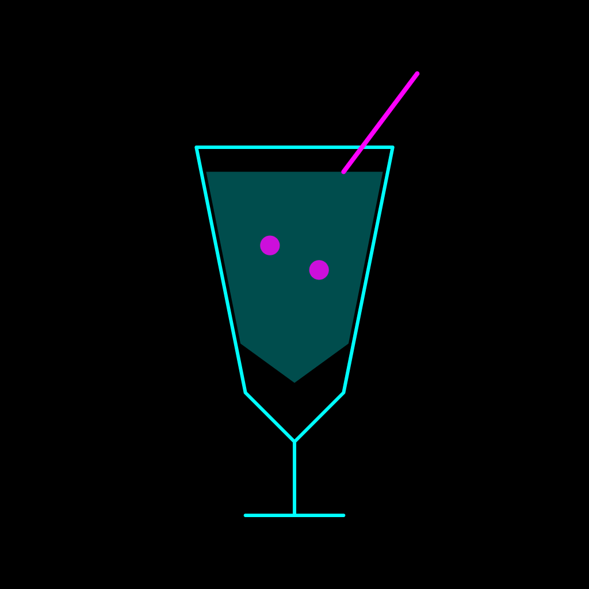
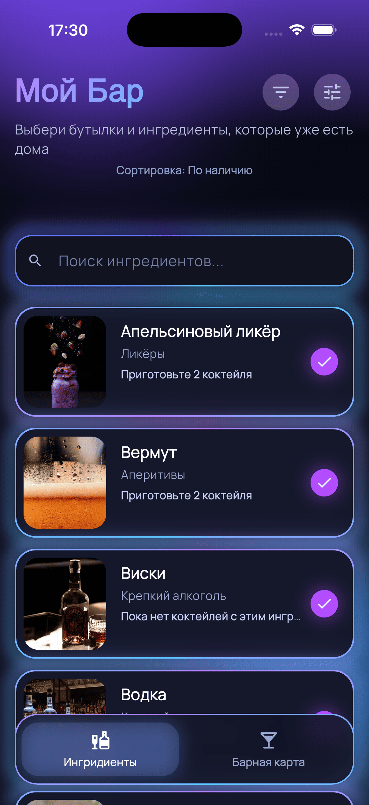
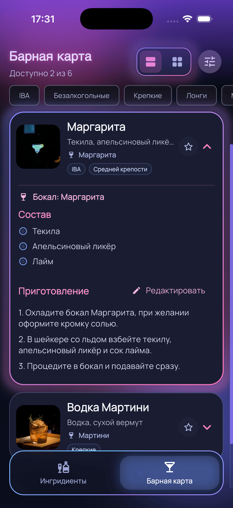
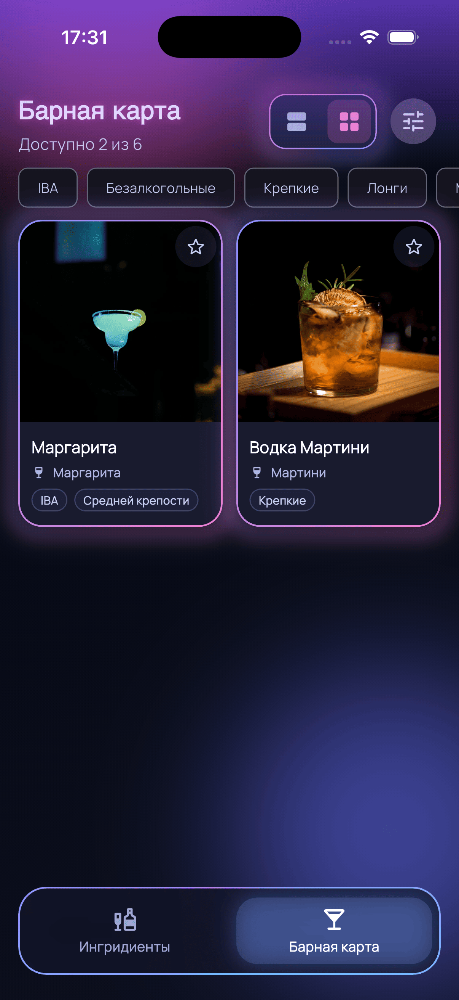
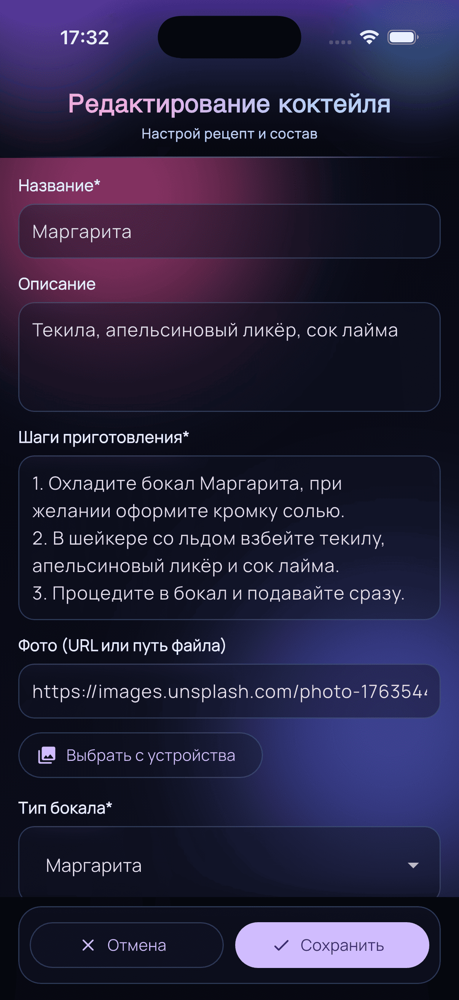

# Мой Бар (My Bar)

<p align="right">
  <a href="./README.md">English</a> | <a href="./README.ru.md"><strong>Русский</strong></a>
</p>

<p align="center">
  
</p>

Мобильное Flutter-приложение для управления домашним баром:

- отмечайте, какие ингредиенты есть в наличии,
- получайте список доступных коктейлей,
- создавайте и редактируйте ингредиенты и коктейли,
- импортируйте и экспортируйте барную карту в JSON.

## Основные возможности

- `Сырой бар`: список ингредиентов, поиск, сортировки, отметка наличия.
- `Барная карта`: доступные коктейли в формате списка или плитки, теги, избранное.
- Неоновый стиль интерфейса: градиенты, glow-эффекты, кастомные tooltip и scrollbar.
- Редактор ингредиентов: создание/изменение, фото по URL или из локального файла.
- Редактор коктейлей: отдельная страница создания/изменения рецептов.
- Логика рецептов: опциональные и декоративные ингредиенты, замены, количество и единицы.
- Системы измерения: `ml`, `cl`, `fl oz`.
- Режимы интерфейса: `Режим посетителя` и `Режим барной карты`.
- Поддержка режима энергосбережения.
- Персистентность: выбранные ингредиенты, каталог и UI-настройки сохраняются между перезапусками.
- Импорт/экспорт JSON с валидацией (ингредиенты + коктейли).
- Защита от пустого экспорта: ошибка `Барная карта не изменена`, если выгружать нечего.

## Технологический стек

- Flutter + Dart
- BLoC/Cubit (`flutter_bloc`)
- Локальное хранение: `shared_preferences`
- Импорт файлов: `file_picker`
- Экспорт/шаринг: `path_provider`, `share_plus`
- UI-эффекты: `animated_border_widgets`, `loading_animation_widget`, `google_fonts`

## Архитектура

Проект построен по слоям:

- `domain`: модели (`Ingredient`, `Cocktail`, `BarCatalog`) и константы (теги, бокалы, единицы).
- `data`: абстракции хранения + реализации на `SharedPreferences`, JSON-кодек.
- `cubit`: `BarCubit` + `BarState`, основная бизнес-логика.
- `presentation`: `BarHomeShell`, страницы и UI-виджеты.

Состояние приложения централизовано в `BarCubit` и сохраняется при каждом изменении.

## Структура проекта

- `lib/app` - инициализация и верхнеуровневая сборка приложения.
- `lib/core` - тема, базовые виджеты, локализация, утилиты поиска.
- `lib/features/bar` - основной функционал бара (data/domain/cubit/presentation).
- `assets/data/bar_template.json` - шаблонный каталог по умолчанию.
- `assets/icon.png` - исходная иконка приложения.
- `docs/privacy-policy.md` - шаблон политики конфиденциальности для публикации.
- `test/` - unit и widget тесты.

## Скриншоты

<table>
  <tr>
    <td align="center" valign="top">
      
      <br />
      <sub><b>Сырой бар</b></sub>
      <br />
      <sub>Поиск, сортировки и наличие ингредиентов</sub>
    </td>
    <td align="center" valign="top">
      
      <br />
      <sub><b>Барная карта (список)</b></sub>
      <br />
      <sub>Раскрытая карточка коктейля и состав</sub>
    </td>
  </tr>
  <tr>
    <td align="center" valign="top">
      
      <br />
      <sub><b>Барная карта (плитка)</b></sub>
      <br />
      <sub>Сеточный вид для быстрого просмотра</sub>
    </td>
    <td align="center" valign="top">
      
      <br />
      <sub><b>Редактор коктейля</b></sub>
      <br />
      <sub>Создание и настройка рецептов</sub>
    </td>
  </tr>
</table>

## JSON-формат барной карты

Файл импорта/экспорта имеет структуру:

```json
{
  "ingredients": [
    {
      "id": "vodka",
      "name": "Водка",
      "category": "Крепкий алкоголь",
      "image": "",
      "isDecoration": false,
      "isOptional": false
    }
  ],
  "cocktails": [
    {
      "id": "black-russian",
      "name": "Черный русский",
      "image": "",
      "ingredients": ["vodka", "coffee_liqueur"],
      "description": "Крепкий кофейный коктейль",
      "preparationSteps": [
        "Наполните рокс льдом",
        "Добавьте ингредиенты и аккуратно перемешайте"
      ],
      "glassType": "Рокс",
      "tags": ["Крепкие", "IBA"],
      "ingredientSubstitutions": {
        "coffee_liqueur": ["kahlua"]
      },
      "ingredientAmounts": {
        "vodka": "50",
        "coffee_liqueur": "20"
      },
      "ingredientUnits": {
        "vodka": "мл",
        "coffee_liqueur": "мл"
      },
      "optionalIngredients": [],
      "decorationIngredients": [],
      "isFavorite": false
    }
  ]
}
```

Валидация реализована в `BarCatalogJsonCodec`.

## Запуск проекта

### Требования

- Flutter stable
- Dart SDK `^3.10.8` (см. `pubspec.yaml`)
- Xcode (для iOS) / Android Studio + SDK (для Android)

### Установка и запуск

```bash
flutter pub get
flutter run
```

## Полезные команды

Проверка кода:

```bash
flutter analyze
```

Тесты:

```bash
flutter test
```

Обновить иконки приложения из `assets/icon.png`:

```bash
dart run flutter_launcher_icons
```

Если после обновления показывается старая иконка, переустановите приложение на устройстве.

## Экран управления баром

Меню `Управление баром`:

- Добавить ингредиент
- Добавить коктейль
- Настройки
- О приложении

В `Настройках`:

- Режим посетителя
- Режим барной карты
- Импортировать барную карту
- Экспортировать барную карту

## Политика конфиденциальности

- [Privacy Policy (English)](docs/privacy-policy.md)

## Лицензия

Проект распространяется по лицензии [MIT](LICENSE).

## Ссылки

- [animated_border_widgets](https://pub.dev/packages/animated_border_widgets)
- [LOGION](https://logion-web.ru/)
